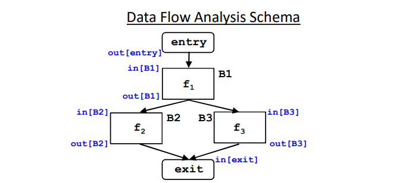

## What is dataflow analysis

* Analyze effect of each basic block

* Compose effects of basic blocks to derive information at basic block boundaries

* from basic block boundaries, apply local technique to generate information on instructions

Data flow analysis:

* Flow-sensitive: sensitive to the control flow in a function

* intraprocedural analysis

Example of optrimization:

* Constant propagation(常量传播)

* Common subexpression elimination(公共子表达式删除)

* Dead code elimination(死代码消除)

## Data Flow Analysis Schema(数据流分析架构)

* Build a flow graph (nodes = basic blocks, edges = control flow)

* Set up a set of equations between in[b] and out[b] for all basic blocks b

  * Effect of code in basic block:
    * Transfer function fb relates in[b] and out[b], for same b
  * Effect of flow of control:
    * relates out[b], in[b’] if b and b’ are adjacent
    * Find a solution to the equations

## Support intrinsics

* llvm/include/llvm/IR/Intrinsics.td
* clang/include/clang/Basic/Builtins.def
